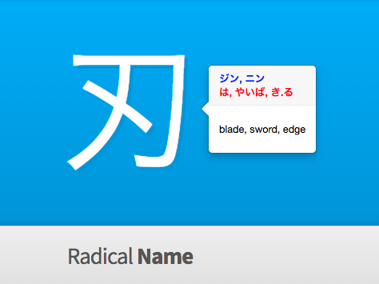

---
# I guess I have to do this?
layout: default
sass_file: index
#title: Rob Keleher!!!
---

##  GitHub Projects

### [WaniKani Enhanced Mobile Design](https://gist.github.com/tryforceful/ff2c36baddf2a5029aa1cf03215d7880#file-tryf-wk-enhnaced-mobile-css-userscript-js) 
Overwrites existing mobile viewport CSS stylings of [wanikani.com](http://www.wanikani.com) in review and lesson mode, making the site more mobile-friendly.

### [WaniKani Clickable Popover &amp; Study Assistant](https://gist.github.com/tryforceful/5a2682f76b359ba283913eaebe34f8e6) 
On WaniKani reviews and lessons, shows reading & translation info in a popover when hovering over quiz kanji/vocab words. Also provides a clickable link to [jisho.org](http://www.jisho.org) for the relevant quiz item.

### [WaniKani Audio for Japanese Example Sentences](https://gist.github.com/tryforceful/e7c44b2e715ae3e7679b7e108d84d2b0) 
Adds audio talkback support in male and female Japanese voices to example sentences on WaniKani lessons and reviews.

### WaniKani Kanji Recognition Study Tool Incomplete
A tool based on WaniKani to help you practice recognizing kanji visually.
